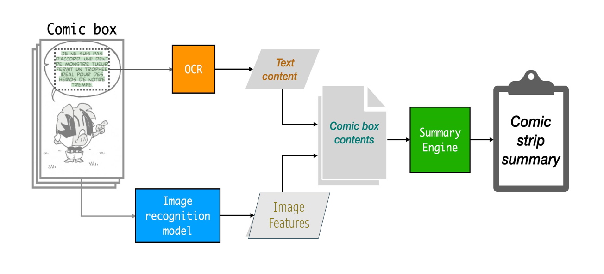
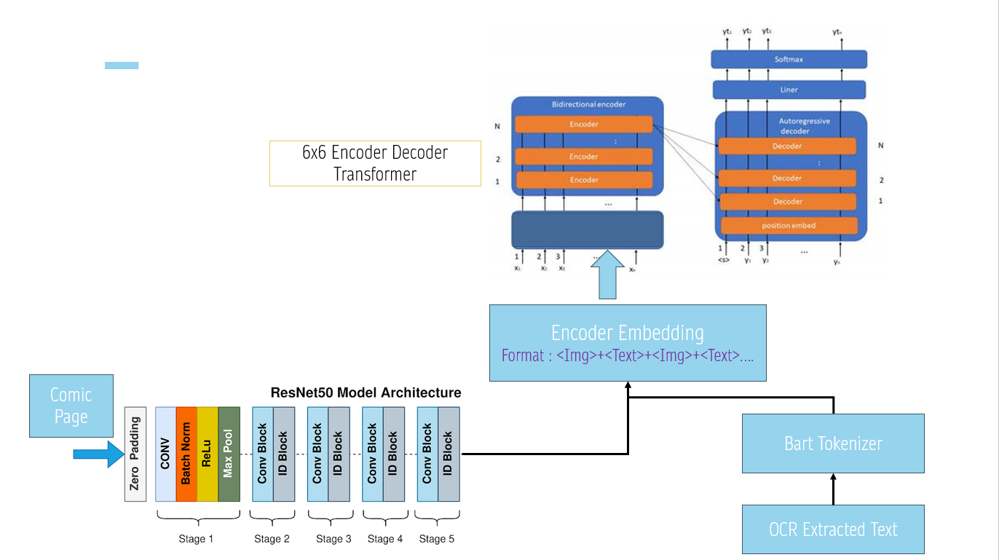

# Visual Story Compression: Towards Automatic Summarization of Comics
#### M B Ashish, Ankur Sinha, Nitin Rajesh, Nitish Mahapatre

## Abstract
This project explores automatic summarization of comic books using **multimodal language models** techniques that combine vision and language. Comics present a unique challenge: their narratives unfold through both images and text, and meaningful summarization requires understanding how the two interact over time.

### [📄 Full Report](https://github.com/mbashish007/ComicSummarizer/blob/main/NLP_Report.pdf)

---

## Overview

- **Goal**: To develop a system that generates abstractive summaries of comic strips by understanding both visual (panels) and textual (dialogue) content.
- **Challenge**: Comics are inherently multimodal—images and text are jointly responsible for advancing the storyline.
- **Approach**: Combine computer vision and NLP techniques in a unified encoder-decoder transformer framework.

---

## Project Highlights

- Developed a **BART-style multimodal transformer** that fuses OCR text and image features from comic panels.
- Implemented **pretraining from scratch on language modeling and fine tuning for summarization tasks**, including knowledge distillation from larger teacher models.
- Fine-tuned the model on **a subset of the VITA/Comic-9K dataset (~79 comic books)** to capture image-text narrative patterns in real comic stories.

---

## System Architecture

> **Visual Feature Extraction**:  
ResNet-50 extracts high-level visual features from each panel.

> **Text Extraction**:  
OCR is applied to extract dialogue/narration from panels.

> **Multimodal Fusion**:  
Visual embeddings and OCR tokens are passed to a shared BART encoder-decoder model, which generates abstractive summaries.

---

## Notebooks for Reproducibility

### [LLM Summarizer Design / Pretraining](https://nbviewer.org/github/mbashish007/ComicSummarizer/blob/main/CustomBART.ipynb)  
Covers architecture, pretraining with Masked Language Modeling and summarization on datasets like BookCorpus and XSum.

### [Multimodal Comic Summarizer Finetuning](https://nbviewer.org/github/mbashish007/ComicSummarizer/blob/main/BartWithVision.ipynb)  
Details fine-tuning of the BART+ResNet system on the Comic-9K dataset.

---

## Pretraining Strategy

- **Masked Language Modeling** on:
  - BookCorpus
  - ROC Stories
  - WikiBooks2048
  - nampdn-ai/mini-en

- **Abstractive Summarization** on:
  - XSum dataset (single-sentence news summaries)

- **Distillation Learning**:
  - Teachers: `bart-large` and `bart-large-xsum`
  - Student model benefits from pretrained knowledge

---

## Dataset Used

**VITA/Comic-9K**  
- 1,792 unique comic stories  
- ~44,500 comic panels  
- Rich multimodal storytelling across image + dialogue  
- Ground-truth summaries available for supervised training

---

## Limitations & Future Work

- Due to limited training time, the model produced repetitive summaries that lacked diversity and deeper narrative abstraction.
- There is currently **no publicly available page-level summary dataset** for comics, making it difficult to train or evaluate small context size summarization models effectively.
- Future improvements:
  - Longer pretraining schedules
  - Panel-order modeling and temporal flow
  - Enhanced visual-linguistic fusion techniques
  - Development or annotation of structured, fine-grained comic summary datasets

---

## Summary

This project takes an ambitious step toward enabling **narrative understanding in visual media, specifically comic books**, through multimodal summarization. To our knowledge, this is among the first systems that integrates computer vision and transformer-based language models to generate coherent summaries from both visual and textual comic content. The design and application to comics is novel and underexplored, marking early progress in this emerging research direction.

---

